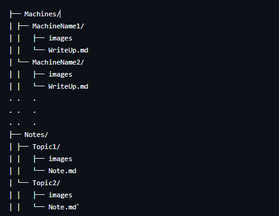

# 🧠 Hack The Box – Notes & Writeups

Welcome to my **Hack The Box** repository! This is a personal collection of **notes**, **writeups**, and **walkthroughs** created while solving HTB machines, challenges, and labs.

## 📌 Purpose

I use this repository to:

- 🗒️ Keep track of my learning journey and workflow
- 🔎 Document methodologies and techniques
- ⚙️ Record enumeration steps, exploitation processes, and privilege escalation paths
- 🧪 Practice for real-world scenarios and OSCP-style challenges

## 📁 Structure

The content in this repository is organized as follows:
`HackTheBox/

Each machine or challenge contains steps from initial recon to root/system or flag capture.

## 🚀 Skills Covered

- Reconnaissance & Enumeration  
- Web Exploitation  
- Buffer Overflows  
- Windows/Linux Privilege Escalation  
- Reverse Engineering  
- Scripting & Automation  
- Real-world Exploitation Techniques

## 🔒 Disclaimer

All writeups are intended for **educational purposes only**. I do not endorse or condone illegal activities. Everything documented here is done on **legal platforms like Hack The Box**.

